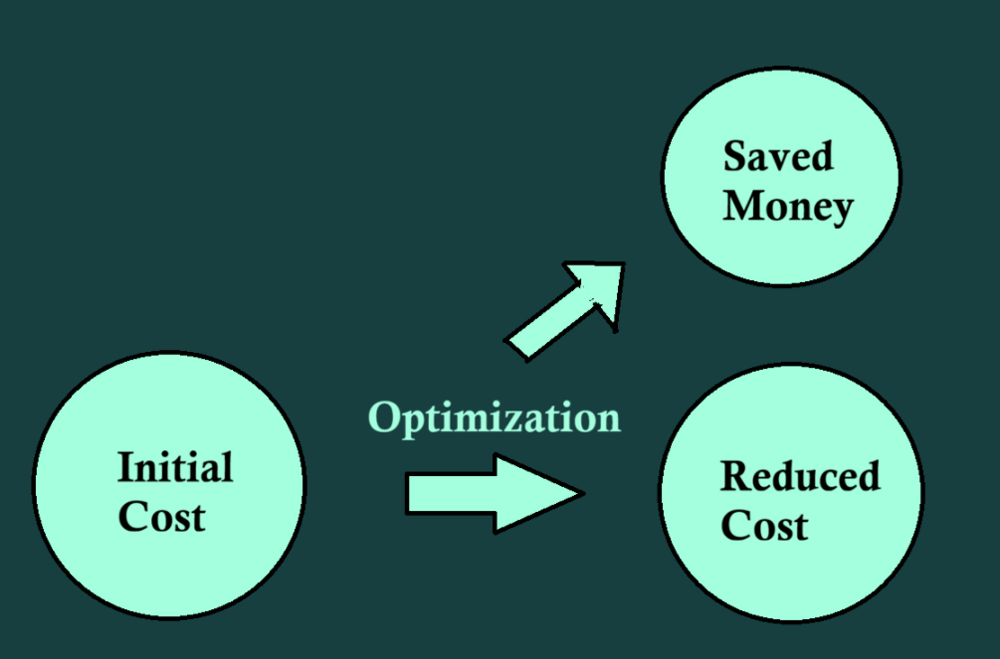
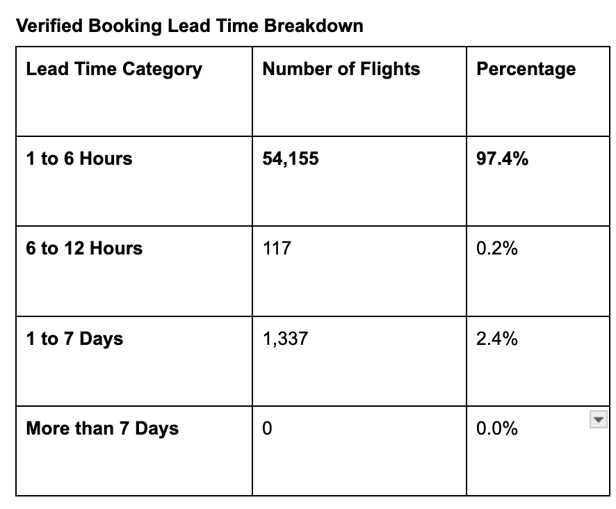
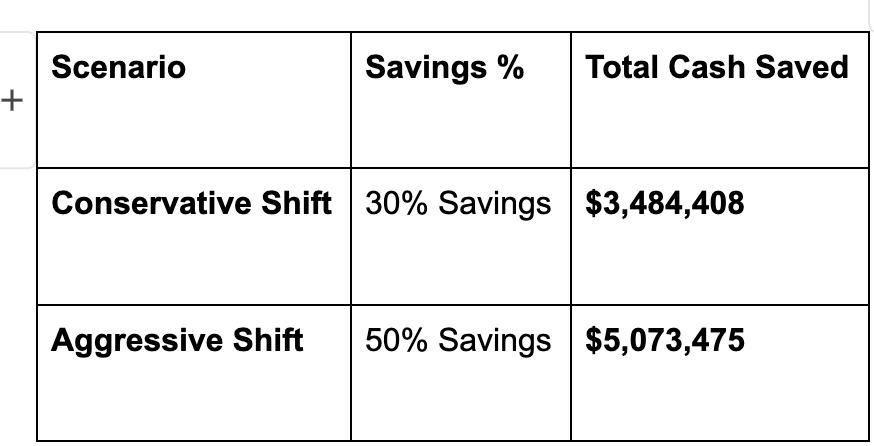
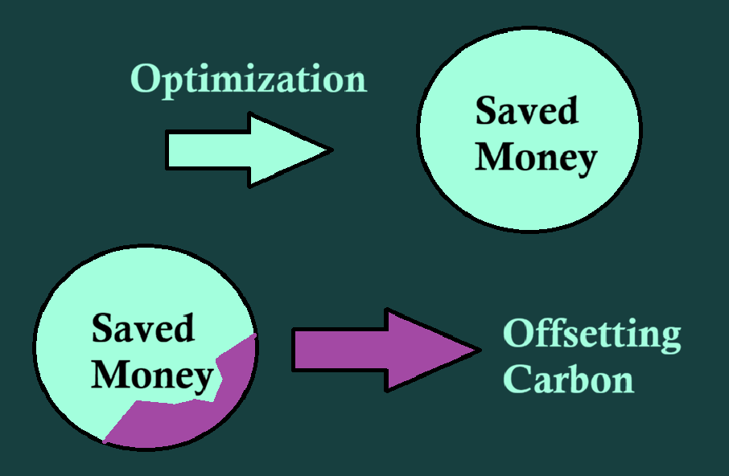
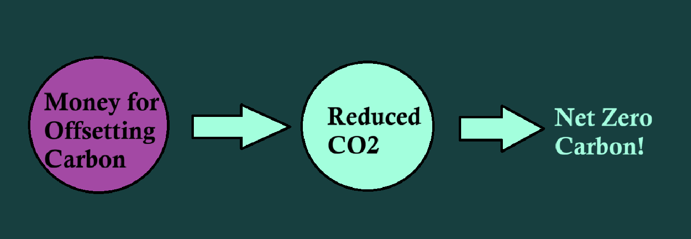
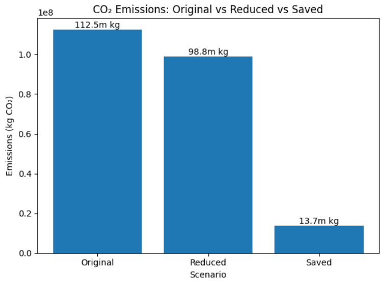
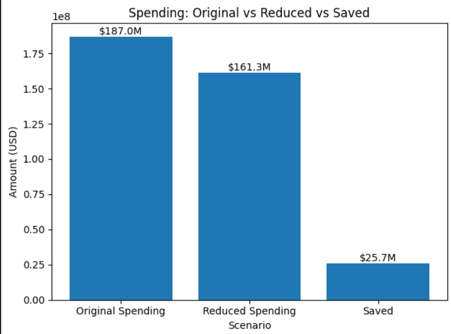

# CO2 Emissions and Cost Optimization through Celonis

  

By **Nithin Vijaykumar**, in collaboration with teammates Noah Graber, Isaac Elias, Nafkot Makonnen, Omar Mohamed, and Tyrike Daniels (**Team JavaCuppaMatcha**).

Submission for the [Analytics for Good Hackathon 2026](https://carlsonschool.umn.edu/conferences/agihackathon) at the University of Minnesota Carlson School of Management (January 30–31, 2026).

[View the presentation (PPTX)](AGI-Hackathon-JavaCuppaMatcha.pptx)

## Problem Statement

How can we reduce the cost of corporate travel while also reducing environmental impact?

## Approach

We used Celonis process mining to analyze corporate travel data and identify optimization opportunities across four key areas, then modeled a path to net-zero emissions through carbon offsetting.

  

## Process Optimization

### 1. Unfunded Missed Trips — Saves ~2 million kg CO2

- **1,059,518 kg CO2** spent on out-of-policy, purposeless trips that were never approved (n=573)
- **3,000,031 kg CO2** spent on general unapproved trips with no listed reason (n=2,255)
- Average potential CO2 reduction: **~2 million kg**

### 2. Reimbursed Anomalies — Saves $6M and ~11.7 million kg CO2

- **$5.98M** spent on out-of-policy trips where travelers changed/missed flights, switched transport modes, or changed hotels without authorization (n=2,791)
- **4.8 million kg CO2** eliminated by removing these anomalous cases
- **6.9 million kg CO2** reduced by aligning remaining out-of-policy trips with in-policy averages (e.g., minimizing first/business class)
- Policy recommendation: deny reimbursement for unauthorized changes on out-of-policy trips

### 3. Ad-hoc Transport Optimization — Saves $16.2M

- Identified **19,853 suboptimal trips** through algorithmic vehicle selection based on distance thresholds
- Used Monte Carlo simulation to model alternative scenarios and find optimal transport modes
- **Case study:** Hamburg–Berlin (255 km) — BMW 3 diesel ($3,900) vs. Fiat 500 electric ($668) = 83% cost inefficiency

### 4. Booking Timing — Saves $3.5M

- Shifting last-minute bookings (1–6 hours prior) to 7–14 days in advance avoids premium "walk-up" fares
- Potential savings on the $116M spent on last-minute bookings

  
   
  <em>97.4% of flights were booked just 1–6 hours in advance</em>

  
   
  <em>Potential savings from shifting booking windows earlier</em>

### 5. Flight Class Policy — Saves $6.8M and 17 million kg CO2

- 21,299 trips were booked in premium classes (20,015 business, 1,284 first class)
- Policy recommendation: downgrade lower-level employees to economy; restrict first class

## Net-Zero Path: Carbon Offsetting

With process optimizations reducing **13.7 million kg CO2**, the remaining **98.8 million kg** can be offset through verified carbon credits:

- 1 carbon credit = 1 metric ton CO2 removed
- Market price: ~$12–$21 per credit (via vendors like CoolEffect.org, TradeWater.co)
- At $12/credit: **$1.186M to fully offset remaining emissions** — just **0.63%** of original travel costs
- Credits follow the Verified Carbon Standard (VCS) with official documentation for legal and financial claims

  
  
   
  <em>Reinvesting savings into carbon credits to reach net-zero emissions</em>

### Why It Matters

- **Regulatory compliance:** Scope 3 emissions (suppliers, transportation, employee commuting) are increasingly subject to carbon taxation, especially under EU regulations
- **ESG and investor appeal:** Carbon offsets enhance brand reputation, customer loyalty, and investor confidence
- **Green ROI:** Supports compliance while improving efficiency and CSR outcomes

## Results Summary

| Metric | Value |
|---|---|
| **Total CO2 Reduced** | 112.5 million kg |
| CO2 reduced (process optimization) | 13.7 million kg |
| CO2 offset (carbon credits) | 98.8 million kg |
| **Pool of Potential Savings** | $25.7M (before offset) / $24.5M (after offset) |

  
  
   
  <em>Overall impact: CO2 emissions (left) and travel spending (right)</em>

# umn-agi-hackathon
